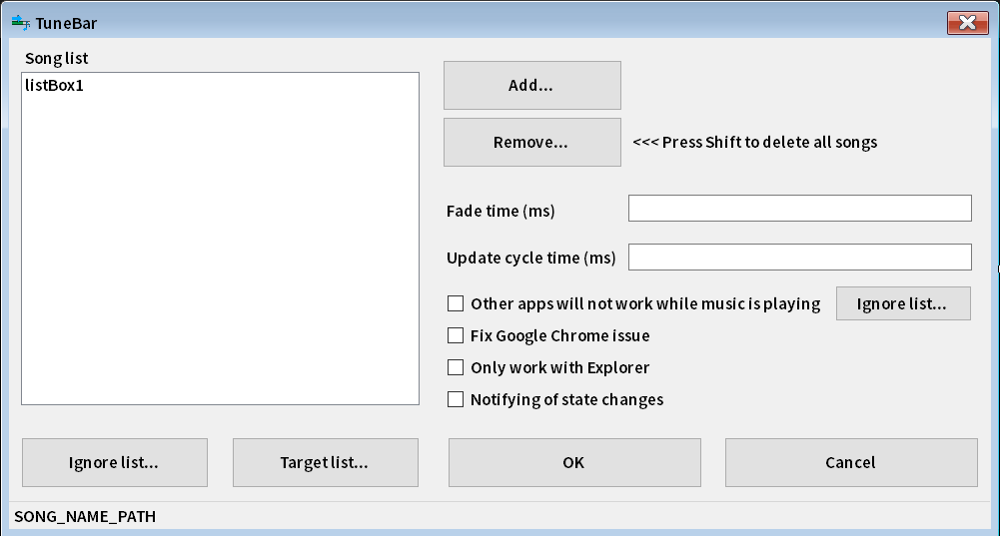

# TuneBar - Created By QuestDragon
Version: 1.0.0.0
## How it was created
An article appeared on Google Discover.

The article was about using music to relieve the tedium of the progress bar, and was an introduction to an application that automatically plays a specified music file while the copying window is displayed.

I thought it was an interesting application, so I decided to remake it myself. That's how it all began.

By the way, the application that inspired me was [this application](https://instantelevatormusic.com/).

## function
Some of the functions of the reference application have not been implemented.

The following are examples of functions that have not been implemented:

| Unimplemented features  | Feature Description |
| ------------- | ------------- |
| Supports a wide range of music file extensions  | In addition to `.mp3` and `.wav`, `.mp4`, `.flac`, `.ogg`, `.m4a`, `.wma`, etc.  |
| Firefox extension for playing music while downloading  | If you install a dedicated Firefox Add-On, you can automatically play music while downloading.  |
| Splash screen support for Office, Visual Studio, etc.  | Ability to automatically play music while the splash screen is displayed |
| App volume settings  | Ability to set volume on the application side instead of using the Windows volume mixer |

The following is a description of the implemented features.

| TuneBar Features  | Feature Description |
| --- | --- |
| Supported music file extensions  | Only `.mp3` and `.wav` are accepted.  |
| Forced playback function  | Normally, music will only be played while the progress bar is displayed in the window, but it can also be used as a music player that randomly selects and plays music files, regardless of whether the progress bar is displayed or not. |
| Pause function  | You can pause the operation of TuneBar. |
| Skip function  | You can skip the currently playing music and play the next song.。 |
| Fade in/out function  | You can apply fade-in/out effects when playback starts and stops.  |
| Detects other applications that are playing sound  | It can detect applications that emit sound, such as media player applications, and prevent them from running. You can also set detection exclusions. |
| Google Chrome Anti-Countermeasure Functions  | Depending on your environment, using Google Chrome may cause the site to run slowly, so we have provided an option to resolve this issue. |
| Action notification function  | It implements a function to notify the operating status of TuneBar, such as the name of the music file currently being played. |
| Exclusions  | Even if the progress bar is displayed, if it is due to a specified application, it can be disabled. |
| Operation Settings  | If a progress bar appears but is not due to a window of a given application, it can be disabled. |

## Adding new features and feedback
The creator is a beginner, so there are probably many imperfections.

If you find any problems, please contact QuestDragon.

Also, if you have any requests for features you would like, or if you would like something done like this, please let us know.

We may not be able to respond quickly, but we will do so if we feel like it... lol (?)

## Development environment
I am using C#.

The application type is Windows Forms Application.

The target framework setting is set to `net6.0-windows10.0.17763.0`.

The NuGet packages used are as follows.

| NuGet package name  | Why we use it |
| --- | --- |
| [Interop.UIAutomationClient](https://www.nuget.org/packages/Interop.UIAutomationClient/10.19041.0?_src=template) | I am using it to get the progress bar and window. |
| [MessagePack](https://www.nuget.org/packages/MessagePack/2.5.172?_src=template) | Used to save setting data. |
| [Microsoft.Toolkit.Uwp.Notifications](https://www.nuget.org/packages/Microsoft.Toolkit.Uwp.Notifications/7.1.3?_src=template) | I am using it to display toast notifications. |
| [NAudio](https://www.nuget.org/packages/NAudio/2.2.1?_src=template) | I use it to play music files. |
| [TagLibSharp](https://www.nuget.org/packages/TagLibSharp/2.3.0?_src=template) | Used to obtain album art from music files. |

## Installation
Download the installer file from the [Release page](https://github.com/QuestDragon/TuneBar/releases/latest) and run it to install.

## How to use

### Basic operations

After installation, run `TuneBar.exe` to start the program.

After the splash screen is displayed for about 1 second, the program will reside in the task tray and monitor for the presence of a progress bar.

If a progress bar is found, the program will randomly select and play a specified music file.

Playback will pause if the progress bar window is closed.

### Task tray icon context menu

After displaying the splash screen, TuneBar will reside as an icon in the task tray.

You can use various functions by right-clicking on the task tray icon.

#### Double-click action

Double-click the TuneBar task tray icon with the left mouse button to display the settings window.

#### Force play

Plays music with or without a progress bar.

The music that is played will resume from the music that was paused.

If there is no paused music or the music that was playing has finished, a random song from the `Song list` will be played.

If you select this item, the item name will change to "`Return to normal mode`", and the string displayed when you hover the pointer over the task tray icon will change to "`TuneBar (Force playing)`".

If you select this, the original behavior will be restored, and the item name and the string in the task tray icon will return to the state before `Force play`.

> [!IMPORTANT]
> If you close TuneBar, it will return to its original behavior. Therefore, **Force play state cannot be saved.**

> [!NOTE]
> It is not intended to be used as a music player. If you want to use it as a shuffle music player, we recommend using a regular music player instead of TuneBar.

#### Pause

Pauses the operation of TuneBar. When paused, the progress bar is not detected, so music will not be played.

> [!IMPORTANT]
> Since it takes priority over `Force play`, music playback will be paused if `Pause` is enabled even if `Force play` is enabled.

When you select this item, the item name will change to "`Unpause`", and the string displayed when you hover the pointer over the task tray icon will change to "`TuneBar (Paused)`".

When selected, the original behavior will be restored, and the item name and task tray icon string will return to the state they were in before `Pause`.

> [!IMPORTANT]
> If you close TuneBar, it will go back to its original behavior. Therefore, **Pause state cannot be saved.**

#### Next track

Stops the music being played and randomly selects a song from the `Song list` and plays it again.

> [!NOTE]
> TuneBar always randomly selects songs, so they are not selected in the order of `Song list`.
> 
> Also, if there are only a few items in the `Song list`, the same music file may be played even if you run `Next track`.

#### Help (GitHub)

Opens TuneBar's GitHub repository page in your default browser.

If you want to know how to use it, select this and you can read the documentation on GitHub.

#### Settings...

Displays the settings window.

The setting items are explained in [Setting Items](https://github.com/QuestDragon/TuneBar/new/main?filename=README.md#%E8%A8%AD%E5%AE%9A%E9%A0%85%E7%9B%AE).

> [!TIP]
> This function can also be performed by doing the following:
> 
> - Double-click the task tray icon with the left mouse button.
> 
> - Click on a notification that appears when toast notifications are enabled

#### About...

Displays an information window about TuneBar.

You can check the application name, version, and developer name.

To close the window, click the close button in the upper right.

#### Quit app

Quit TuneBar.

> [!CAUTION]
> Unless there is a special reason, please select this option and exit.

### Setting items

You can access the settings window from the context menu, task tray icon, or toast notification.

This section explains the items displayed in the settings window and the settings you can configure.

#### TuneBar設定画面

**Song list**：This is the list of music files that you can choose to play through TuneBar.

**Add...**：This button is for adding music files to the `Song list`. You can add multiple files by selecting them from the open dialog. Only `.mp3` and `.wav` file extensions are supported.

**Remove...**：This button deletes the item selected in the `Song list`. Click the item with the mouse to select it, then press the button to display a confirmation dialog. Click "OK" to delete it.

> [!TIP]
> Hold down the Shift key and click the button to delete all items.

> [!WARNING]
> The deletion operation cannot be undone, so please check the contents on the screen before proceeding.

**Fade time (ms)**：You can apply a fade-in/out effect when playing and stopping a music file. Specify in milliseconds. The default value is `500`.

> [!NOTE]
> If left blank, the placeholder text `0ms` will be used.

**Update cycle time (ms)**：Specifies the cycle for executing the process to detect the progress bar. Specify in milliseconds. The default value is `500`.

> [!NOTE]
> If you leave this field blank, the placeholder text `500ms` will be used.

> [!CAUTION]
> Do not set the `Update cycle time` too short, as this may cause the operation to become unstable.
>
> If you don't know what this does, leave it at the default value (`500`).

**Other apps will not work while music is playing**：This setting prevents TuneBar from playing music while other applications are playing sound. The default value is `False`.

Click the `Ignore list...` button next to the checkbox to exclude the application.

Applications added to the exclusion list will not stop TuneBar music even if they play sound.

> [!TIP]
> For example, you can play a game that you have added to the exclusion settings while copying files, and know when the copying is complete when music playback via TuneBar stops.

**Fix Google Chrome Issue**：This is a setting to resolve issues that may occur in Google Chrome while running TuneBar. The default value is `False`.

Specifically, it excludes Google Chrome's progress bar and new window detection processes.

> [!NOTE]
> If this setting is enabled, `chrome` will not be able to be added to the `Ignore list...` and `Target list...` at the bottom of the `Song list`.

> [!IMPORTANT]
> Please note that this does not completely prevent problems caused by Google Chrome. If you experience any new problems, please report them to us.

**Only work with Explorer**：This setting makes TuneBar work only in Explorer, regardless of the settings of `Ignore list...` and `Target list...` under `Song list`. The default value is `False`.

> [!NOTE]
> If this setting is enabled, the settings in `Ignore list...` and `Target list...` at the bottom of the `Song list` will not be loaded.
>
> If you want to use the `Ignore list` and `Target list` in addition to the Explorer, do not check the checkbox.

**Notifying of state changes**：This setting toggles toast notifications. The default value is `False`.

If you enable toast notifications, you will receive notifications in the following situations:

- When TuneBar starts monitoring the progress bar
- When TuneBar stops monitoring the progress bar
- When the music file played by TuneBar changes
- When the TuneBar settings file is successfully saved
- When an abnormality occurs in the TuneBar settings file and the settings file is recreated
- When an abnormality occurs in the music file played by TuneBar
- When TuneBar is closed

The toast notification icons have the following meanings.

| Displayed icons | meaning |
| --- | --- |
| Information mark | Information display |
| Prohibition mark | Anomaly Occurrence |
| Cover photo | Playing music files |

> [!NOTE]
> If a cover photo cannot be obtained, an `Information mark` will be used.

**Ignore list...**：Displays the setting screen where you can specify applications that will not run TuneBar.

> [!IMPORTANT]
> For this section, please check the [TuneBar list screen](https://github.com/QuestDragon/TuneBar/new/main?filename=README.md#tunebar%E3%83%AA%E3%82%B9%E3%83%88%E7%94%BB%E9%9D%A2).

**Target list...**：A settings screen will be displayed that allows TuneBar to work only in specified applications.

> [!IMPORTANT]
> For this section, please check the [TuneBar list screen](https://github.com/QuestDragon/TuneBar/new/main?filename=README.md#tunebar%E3%83%AA%E3%82%B9%E3%83%88%E7%94%BB%E9%9D%A2).

> [!CAUTION]
> If you add an application to both the `Ignore list` and the `Target list`, the `Ignore list` takes precedence.
>
> However, this type of usage is not anticipated, so in principle please add to only one of the lists.

**SONG_NAME_PATH**：Displays the path of the music file currently being played by TuneBar.

> [!NOTE]
> It will not be displayed when it is not playing (e.g. when it is paused because the progress bar is missing).

**OK**：Save the settings and close the window. After that, TuneBar's internal processing will be restarted.

> [!NOTE]
> If toast notifications are enabled, three notifications will appear: a notification that the save is complete, a notification that the save is disabled, and a notification that the save is enabled.

> [!IMPORTANT]
> Be sure to click this button after adjusting any settings to save them.

**Cancel**：Discards changes and closes the window. The same action can be performed by clicking the close button in the upper right.

> [!CAUTION]
> A confirmation dialog will be displayed, but if you click "`OK`" in this dialog, your changes will be discarded.
>
> Changes that have been discarded cannot be restored, so please be careful not to press the wrong button.

#### TuneBar list screen

**LISTNAME**：The name and description of the list you are currently editing are displayed.

**Bottom of window text box**：Specify the application to add. Enter the process name. Do not enter `.exe`.

> [!NOTE]
> Even if you enter `.exe`, it will be automatically deleted, but it will still be deleted anyway, so it's better not to enter it in the first place.

**OK**：Save your settings and close the window.

> [!NOTE]
> If you have toast notifications enabled, you will be notified when the save is complete.
>
> When you click the "`OK`" button on the list screen, all setting data including the edited list will be saved.

> [!IMPORTANT]
> Be sure to click this button after configuring the list to save your settings.

**Cancel**：Discards changes and closes the window. The same action can be performed by clicking the close button in the upper right.

> [!CAUTION]
> A confirmation dialog will be displayed, but if you click "`OK`" in this dialog, your changes will be discarded.
>
> Please note that only the changes in the list will be discarded; the contents of the [TuneBar setting screen](https://github.com/QuestDragon/TuneBar/new/main?filename=README.md#%E8%A8%AD%E5%AE%9A%E9%A0%85%E7%9B%AE) will be retained.
>
> If you want to save only the contents of [TuneBar setting screen](https://github.com/QuestDragon/TuneBar/new/main?filename=README.md#%E8%A8%AD%E5%AE%9A%E9%A0%85%E7%9B%AE), 
> click the OK button on [TuneBar setting screen](https://github.com/QuestDragon/TuneBar/new/main?filename=README.md#%E8%A8%AD%E5%AE%9A%E9%A0%85%E7%9B%AE) after this operation.

**Current process name list**：A message box will appear with a list of process names currently detected by TuneBar. Process names that have been added to the list will have `(Added)` at the end.

> [!NOTE]
> This is only displayed if you select `Ignore list...` or `Target list...` on the [TuneBar setting screen](https://github.com/QuestDragon/TuneBar/new/main?filename=README.md#%E8%A8%AD%E5%AE%9A%E9%A0%85%E7%9B%AE).

**Current sound playing app list**：A message box will be displayed showing the process names currently detected by TuneBar that are playing sound. Process names that have been added to the list will have `(Added)` at the end.

> [!NOTE]
> This will only be displayed if you select "`Ignore list...`" next to "Other apps will not work while music is playing" in [TuneBar設定画面](https://github.com/QuestDragon/TuneBar/new/main?filename=README.md#%E8%A8%AD%E5%AE%9A%E9%A0%85%E7%9B%AE).

**Remove...**：This button deletes the item selected in the list. Click the item with the mouse to select it, then press the button to display a confirmation dialog. Click "OK" to delete it.

> [!TIP]
> Hold down the Shift key and click the button to delete all items.

> [!WARNING]
> The deletion operation cannot be undone, so please check the contents on the screen before proceeding.

**Add...**：This button is for adding a process name to the list. After entering a name in the text box, click it to add it.

> [!NOTE]
> You cannot add the same process name.

**HOST_WINDOW_PROCESS_NAME**：It will change as follows depending on the operation status of TuneBar.

| Operational Status  | Display Content |
| --- | --- |
| When music is playing  | Displays the process name and window handle ID of the window in which TuneBar detected the progress bar. |
| When the progress bar is displayed and another application is emitting sound  | Displays the process name and window handle ID of the application window that is producing sound detected by TuneBar. |
| When no music is playing  | An explanation will be displayed stating that there are no windows that meet the conditions for TuneBar to operate. |

## Aside
We also had the cooperation of ChatGPT. GPT is great.

## Disclaimer
I, QuestDragon, take no responsibility for any damage caused by the use of this application. Use at your own risk.

Secondary distribution without making any changes to the files is prohibited.

Distribution may be stopped without notice. Please be forewarned.

Feel free to modify it, but it would be appreciated if you could credit me when distributing it.

Rather than saying "I made this from scratch," I would like you to say something like "I changed XX in QuestDragon's TuneBar to △△."

## Author
QuestDragon
