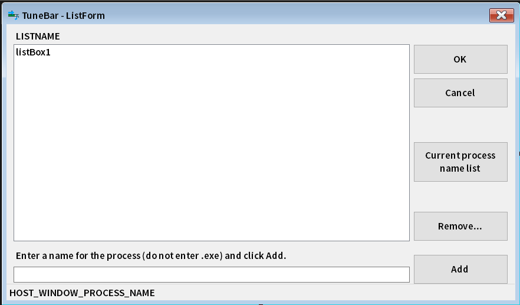

# TuneBar - Created By QuestDragon
Version: 1.0.0.0
## 作成した経緯
GoogleのDiscoverにて、ある記事が表示されていました。

記事の内容は、プログレスバーが表示されている退屈な時間を音楽で解消するというもので、いわゆるコピー中のウィンドウが表示されているときに自動で指定した音楽ファイルを流す、というアプリケーションの紹介記事でした。

面白いアプリケーションだなと思い、自分でリメイクしてみることにしました。これが発端です。

ちなみに、インスパイアしたのは[こちらのアプリケーション](https://instantelevatormusic.com/)です。

## 機能
参考にしたアプリケーションの機能のうち、一部の機能は実装できていません。

実装していない内容の一例としては次の通りです。

| 実装していない機能  | 機能の説明 |
| ------------- | ------------- |
| 豊富な音楽ファイルの拡張子サポート  | `.mp3`や`.wav`の他、`.mp4`、`.flac`、`.ogg`、`.m4a`、`.wma`など。  |
| Firefoxの拡張機能によるダウンロード中の音楽再生  | 専用のFirefox Add-Onを導入すると、ダウンロード中に音楽を自動で再生する機能  |
| OfficeやVisual Studioなどのスプラッシュスクリーン対応  | スプラッシュスクリーンが表示されている間、自動で音楽を再生する機能 |
| アプリ側での音量設定  | Windowsの音量ミキサーではなく、アプリケーション側で音量を設定する機能 |

以下は実装している機能についての説明です。

| TuneBarの機能  | 機能の説明 |
| --- | --- |
| サポートしている音楽ファイルの拡張子  | `.mp3`、`.wav`のみとなります。  |
| 強制再生機能  | 通常はプログレスバーが表示されているウィンドウがある間だけ音楽を再生しますが、プログレスバーの有無に関係なく、ランダムに音楽ファイルを選んで再生する音楽プレーヤーとして使用することができます。 |
| 一時停止機能  | TuneBarの動作を一時停止することができます。 |
| スキップ機能  | 現在再生している音楽をスキップして次の楽曲を再生することができます。 |
| フェードイン・アウト機能  | 再生開始時と停止時にフェードイン・アウトのエフェクトをかけることができます。  |
| 他に音を出しているアプリケーションの検知機能  | メディアプレーヤーアプリケーションなど、音を出しているアプリケーションを検知して動作しないようにすることができます。検知の除外設定もできます。 |
| Google Chrome対策機能  | 環境によってはGoogle Chromeを使用していると動作が遅くなったりする場合があるため、この問題を解消するオプションを用意しています。 |
| 動作通知機能  | 現在再生している音楽ファイル名など、TuneBarの動作状態を通知する機能を実装しています。 |
| 除外設定  | プログレスバーが表示されていても、指定されたアプリケーションによるものである場合、動作しないようにすることができます。 |
| 動作指定  | プログレスバーが表示されていても、指定されたアプリケーションのウィンドウでない場合、動作しないようにすることができます。 |

## 機能追加、フィードバックについて
制作者は初心者なので何かと至らないところがあると思います。

不具合等を発見しましたら、QuestDragonまでご連絡ください。

また、「こんな機能がほしい！」「ここはこうしてほしい！」という要望がありましたらご相談ください。

対応は早くないかもしれませんが、気が向いたら対応します…ｗ（？）

## 開発環境
C#を使用しています。

アプリケーションの種類はWindowsフォームアプリケーションです。

ターゲットフレームワーク設定は`net6.0-windows10.0.17763.0`に設定しています。

使用しているNuGetパッケージは以下の通りです。

| NuGetパッケージ名  | 使用している理由 |
| --- | --- |
| [Interop.UIAutomationClient](https://www.nuget.org/packages/Interop.UIAutomationClient/10.19041.0?_src=template) | プログレスバーとウィンドウの取得に使用しています。 |
| [MessagePack](https://www.nuget.org/packages/MessagePack/2.5.172?_src=template) | 設定データの保存に使用しています。 |
| [Microsoft.Toolkit.Uwp.Notifications](https://www.nuget.org/packages/Microsoft.Toolkit.Uwp.Notifications/7.1.3?_src=template) | トースト通知の表示に使用しています。 |
| [NAudio](https://www.nuget.org/packages/NAudio/2.2.1?_src=template) | 音楽ファイルの再生に使用しています。 |
| [TagLibSharp](https://www.nuget.org/packages/TagLibSharp/2.3.0?_src=template) | 音楽ファイルのアルバムアート取得に使用しています。 |

## インストール
[Releaseページ](https://github.com/QuestDragon/TuneBar/releases/latest)からインストーラーファイルをダウンロードし、実行してインストールして下さい。

## 使用方法

### 基本

インストール後、`TuneBar.exe`を実行すると起動します。

スプラッシュスクリーンが約1秒間表示されたあと、タスクトレイに常駐し、プログレスバーの有無を監視します。

プログレスバーが見つかると指定された音楽ファイルをランダムに選定して再生します。

再生中にプログレスバーのウィンドウが閉じられると一時停止します。

### タスクトレイアイコンのコンテキストメニュー

TuneBarはスプラッシュスクリーンを表示したあとはタスクトレイにアイコンとして常駐するようになります。

タスクトレイアイコンを右クリックすることで様々な機能を使用することができます。

#### ダブルクリックした時の動作

TuneBarのタスクトレイアイコンを左マウスボタンでダブルクリックすると設定ウィンドウが表示されます。

#### Force play

プログレスバーの有無にかかわらず、音楽を再生します。

再生される音楽は一時停止していた音楽が再開されます。

一時停止していた音楽がない、または再生していた音楽が終了した場合は`Song list`からランダムに選定され、再生されます。

この項目を選択すると項目名が「`Return to normal mode`」という項目に変わり、タスクトレイアイコンにポインターを合わせた際に表示される文字列が「`TuneBar (Force playing)`」に変わります。

選択すると元の動作に戻り、項目名とタスクトレイアイコンの文字列も`Force play`前の状態に戻ります。

> [!IMPORTANT]
> TuneBarを終了した場合も元の動作に戻ります。そのため、**Force playの状態を保存することはできません。**

> [!NOTE]
> 音楽プレーヤーとしての使用は想定されていません。シャッフル再生する音楽プレーヤーとして使用する場合はTuneBarではなく通常の音楽プレーヤーを使用することを推奨します。

#### Pause

TuneBarの動作を一時停止します。一時停止中はプログレスバーの検知を行わないため、音楽は再生されません。

> [!IMPORTANT]
> `Force play`よりも優先して動作するため、`Force play`が有効でも`Pause`を有効にすると音楽の再生は一時停止します。

この項目を選択すると項目名が「`Unpause`」という項目に変わり、タスクトレイアイコンにポインターを合わせた際に表示される文字列が「`TuneBar (Paused)`」に変わります。

選択すると元の動作に戻り、項目名とタスクトレイアイコンの文字列も`Pause`前の状態に戻ります。

> [!IMPORTANT]
> TuneBarを終了した場合も元の動作に戻ります。そのため、**Pauseの状態を保存することはできません。**

#### Next track

再生中の音楽を停止し、`Song list`から再度ランダム選定して再生します。

> [!NOTE]
> TuneBarは常に楽曲をランダム選定します。そのため、`Song list`の順番通りに選ばれるわけではありません。
> 
> また、`Song list`の項目数が少ない場合、`Next track`を実行しても同じ音楽ファイルが再生されることがあります。

#### Help (GitHub)

TuneBarのGitHubリポジトリページをデフォルトブラウザーで表示します。

使い方を知りたい場合に選択するとGitHub上でこのドキュメントを読んで確認することができます。

#### Settings...

設定ウィンドウを表示します。

設定項目に関しては[設定項目](https://github.com/QuestDragon/TuneBar/new/main?filename=README.md#%E8%A8%AD%E5%AE%9A%E9%A0%85%E7%9B%AE)にて説明しています。

> [!TIP]
> この機能は次の操作をすることでも同様の動作を行います。
> 
> ・タスクトレイアイコンを左マウスボタンでダブルクリックする
> 
> ・トースト通知を有効にしている状態で表示された通知をクリックする

#### About...

TuneBarに関する情報ウィンドウを表示します。

アプリケーション名、バージョン、開発者名が確認できます。

ウィンドウを閉じる際は右上の閉じるボタンをクリックして下さい。

#### Quit app

TuneBarを終了します。

> [!CAUTION]
> 特別な理由がない限りはこの項目を選択して終了して下さい。

### 設定項目

コンテキストメニューやタスクトレイアイコン、トースト通知から設定ウィンドウにアクセスすることができます。

ここでは設定ウィンドウにて表示される項目と設定できる内容について説明します。

#### TuneBar設定画面

**Song list**：TuneBarから再生するために指定された音楽ファイルのリストです。

**Add...**：`Song list`に音楽ファイルを追加するためのボタンです。開くダイアログから複数選択して追加できます。対応拡張子は`.mp3`、`.wav`のみとなっています。

**Remove...**：`Song list`で選択した項目を削除するボタンです。項目をマウスでクリックして選択し、ボタンを押すと確認ダイアログが表示されます。「OK」をクリックして削除できます。

> [!TIP]
> Shiftキーを押しながらボタンをクリックすると全ての項目を削除できます。

> [!WARNING]
> 削除の操作は元に戻せませんので、画面の内容をご確認の上実行して下さい。

**Fade time (ms)**：音楽ファイルの再生時と停止時にフェードイン・アウトのエフェクトをかけることができます。ミリ秒で指定します。初期値は`500`です。

> [!NOTE]
> 空欄にした場合はプレースホルダーテキストに表示されている`0ms`が適用されます。

**Update cycle time (ms)**：プログレスバーを検知する処理を実行する周期を指定します。ミリ秒で指定します。初期値は`500`です。

> [!NOTE]
> 空欄にした場合はプレースホルダーテキストに表示されている`500ms`が適用されます。

> [!CAUTION]
> `Update cycle time`は短く指定しすぎないようにして下さい。動作が不安定になる恐れがあります。
>
> この項目が何をしているか分からない場合は初期値（`500`）のままにしておいて下さい。

**Other apps will not work while music is playing**：他のアプリケーションが音を鳴らしている間はTuneBarによる音楽の再生を行わない設定です。初期値は`False`に設定されています。

チェックボックスの隣にある`Ignore list...`ボタンをクリックすると、アプリケーションの除外設定が行えます。

除外設定に追加されたアプリケーションは音を鳴らしてもTuneBarの音楽を停止しません。

> [!TIP]
> 使用例としては、ファイルをコピーしている間、除外設定に追加したゲームをプレイし、TuneBarによる音楽の再生が停止したことでコピー完了を知る…というような使い方ができます。

**Fix Google Chrome Issue**：TuneBarを実行している間、Google Chromeにて問題が発生する場合、これを解消するための設定です。初期値は`False`に設定されています。

具体的にはGoogle Chromeのプログレスバーと新規ウィンドウの検知処理を除外します。

> [!NOTE]
> この設定を有効にしている場合、`Song list`下部の`Ignore list...`と`Target list...`に`chrome`が追加できなくなります。

> [!IMPORTANT]
> Google Chromeによる問題を完全に防げるわけではありません。新たな問題が発生した場合はご報告下さい。

**Only work with Explorer**：`Song list`下部の`Ignore list...`と`Target list...`の設定にかかわらず、エクスプローラーにのみTuneBarを動作させる設定です。初期値は`False`に設定されています。

> [!NOTE]
> この設定を有効にしている場合、`Song list`下部の`Ignore list...`と`Target list...`の設定内容は読み込まれなくなります。
>
> エクスプローラーに加えて`Ignore list`や`Target list`を使用したい場合はチェックボックスのチェックを入れないで下さい。

**Notifying of state changes**：トースト通知を切り替える設定です。初期値は`False`に設定されています。

トースト通知を有効にすると、次の場面で通知が送信されます。

- TuneBarがプログレスバーの監視を開始したとき 
- TuneBarがプログレスバーの監視を停止したとき 
- TuneBarが再生する音楽ファイルが変化したとき 
- TuneBarの設定ファイルの保存に成功したとき 
- TuneBarの設定ファイルに異常が発生したため、設定ファイルを再作成したとき 
- TuneBarが再生する音楽ファイルに異常が発生したとき 
- TuneBarを終了するとき 

トースト通知のアイコンは次の意味を持っています。

| 表示されるアイコン | 意味 |
| --- | --- |
| インフォメーションマーク | 情報表示 |
| 禁止マーク | 異常発生 |
| ジャケット写真 | 音楽ファイルの再生 |

> [!NOTE]
> ジャケット写真が取得できなかった場合はインフォメーションマークが使用されます。

**Ignore list...**：TuneBarを動作させないアプリケーションを指定する設定画面を表示します。

> [!IMPORTANT]
> この項に関しては、[TuneBarリスト画面](https://github.com/QuestDragon/TuneBar/new/main?filename=README.md#tunebar%E3%83%AA%E3%82%B9%E3%83%88%E7%94%BB%E9%9D%A2)を確認して下さい。

**Target list...**：指定したアプリケーションにのみTuneBarを動作させる設定画面を表示します。

> [!IMPORTANT]
> この項に関しては、[TuneBarリスト画面](https://github.com/QuestDragon/TuneBar/new/main?filename=README.md#tunebar%E3%83%AA%E3%82%B9%E3%83%88%E7%94%BB%E9%9D%A2)を確認して下さい。

> [!CAUTION]
> アプリケーションを`Ignore list`と`Target list`の両方に追加した場合、`Ignore list`が優先されます。
>
> なお、このような使い方は想定しておりませんので、原則どちらか片方のリストに追加するようにして下さい。

**SONG_NAME_PATH**：TuneBarが現在再生している音楽ファイルのパスが表示されます。

> [!NOTE]
> 再生していない間は表示されません。（例：プログレスバーが見付からないため、一時停止しているときなど）

**OK**：設定内容を保存し、ウィンドウを閉じます。その後、TuneBarの内部処理が再起動されます。

> [!NOTE]
> トースト通知を有効にしている場合は、保存完了の通知、無効化の通知、有効化の通知の3つが表示されます。

> [!IMPORTANT]
> 設定を保存するために、設定調整後はこのボタンを必ずクリックするようにして下さい。

**Cancel**：変更内容を破棄してウィンドウを閉じます。右上の閉じるボタンでも同様の動作になります。

> [!CAUTION]
> 確認ダイアログは表示されますが、このダイアログで「`OK`」を選択してしまうと変更内容は破棄されます。
>
> 破棄された変更内容は復元できませんので、押し間違えにはくれぐれもご注意下さい。

#### TuneBarリスト画面

**LISTNAME**：現在編集中のリスト名と説明が表示されます。

**ウィンドウ下部テキストボックス**：追加するアプリケーションを指定します。プロセス名で入力してください。`.exe`は入力しません。

> [!NOTE]
> `.exe`は入力しても自動で削除されるようにしてありますが、結局消されてしまうので最初から入力しない方が良いと思います。

**OK**：設定内容を保存し、ウィンドウを閉じます。

> [!NOTE]
> トースト通知を有効にしている場合は、保存完了の通知が表示されます。
>
> リスト画面で「`OK`」ボタンをクリックすると、編集したリストを含む全ての設定データが一旦保存されます。

> [!IMPORTANT]
> 設定を保存するために、リストの設定後はこのボタンを必ずクリックするようにして下さい。

**Cancel**：変更内容を破棄してウィンドウを閉じます。右上の閉じるボタンでも同様の動作になります。

> [!CAUTION]
> 確認ダイアログは表示されますが、このダイアログで「`OK`」を選択してしまうと変更内容は破棄されます。
>
> なお、破棄される変更内容はリストの内容のみであり、[TuneBar設定画面](https://github.com/QuestDragon/TuneBar/new/main?filename=README.md#%E8%A8%AD%E5%AE%9A%E9%A0%85%E7%9B%AE)の内容は保持されます。
>
> [TuneBar設定画面](https://github.com/QuestDragon/TuneBar/new/main?filename=README.md#%E8%A8%AD%E5%AE%9A%E9%A0%85%E7%9B%AE)の内容のみを保存する場合はこの操作のあとに
> [TuneBar設定画面](https://github.com/QuestDragon/TuneBar/new/main?filename=README.md#%E8%A8%AD%E5%AE%9A%E9%A0%85%E7%9B%AE)にて「`OK`」ボタンをクリックしてください。

**Current process name list**：現在TuneBarが検知しているプロセス名の一覧がメッセージボックスで表示されます。リストに追加済みのプロセス名には末尾に`(Added)`が表示されます。

> [!NOTE]
> [TuneBar設定画面](https://github.com/QuestDragon/TuneBar/new/main?filename=README.md#%E8%A8%AD%E5%AE%9A%E9%A0%85%E7%9B%AE)にて、「`Ignore list...`」または「`Target list...`」を選択した場合のみ表示されます。

**Current sound playing app list**：現在TuneBarが検知しているプロセス名のうち、音を鳴らしているプロセス名一覧がメッセージボックスで表示されます。リストに追加済みのプロセス名には末尾に`(Added)`が表示されます。

> [!NOTE]
> [TuneBar設定画面](https://github.com/QuestDragon/TuneBar/new/main?filename=README.md#%E8%A8%AD%E5%AE%9A%E9%A0%85%E7%9B%AE)にて、
> 「Other apps will not work while music is playing」の隣にある「`Ignore list...`」を選択した場合のみ表示されます。

**Remove...**：リストで選択した項目を削除するボタンです。項目をマウスでクリックして選択し、ボタンを押すと確認ダイアログが表示されます。「OK」をクリックして削除できます。

> [!TIP]
> Shiftキーを押しながらボタンをクリックすると全ての項目を削除できます。

> [!WARNING]
> 削除の操作は元に戻せませんので、画面の内容をご確認の上実行して下さい。

**Add...**：リストにプロセス名を追加するためのボタンです。テキストボックスに入力後、クリックすると追加されます。

> [!NOTE]
> 同じプロセス名は追加できません。

**HOST_WINDOW_PROCESS_NAME**：TuneBarの動作状況に応じて次のように変化します。

| 動作状況  | 表示内容 |
| --- | --- |
| 音楽が再生されているとき  | TuneBarがプログレスバーを検知したウィンドウのプロセス名とウィンドウハンドルIDが表示されます。 |
| プログレスバーが表示されており、かつ他のアプリケーションが音を出しているとき  | TuneBarが検知した音を出しているアプリケーションのウィンドウのプロセス名とウィンドウハンドルIDが表示されます。 |
| 音楽を再生していないとき  | TuneBarが動作するための条件を満たすウィンドウがない旨の説明が表示されます。 |

## 余談
ChatGPTにも協力してもらいました。さすがGPT。

## 免責事項
本アプリケーションを使用したことにより生じた被害に関して、私QuestDragonは一切の責任を負いかねます。自己責任でご使用ください。

ファイルに一切変更を加えない状態での2次配布は禁止です。

予告なく配布を停止することがあります。予めご了承ください。

改造はご自由にしていただいて構いませんが、配布の際はクレジット表記していただけると助かります。

「一から自作した」というのではなく、「QuestDragonのTuneBarの〇〇を△△にした」のように表記していただければと思います。

## 制作者
QuestDragon
